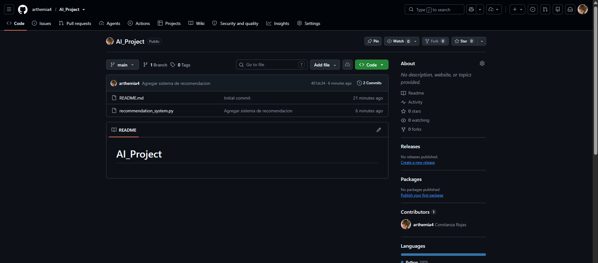
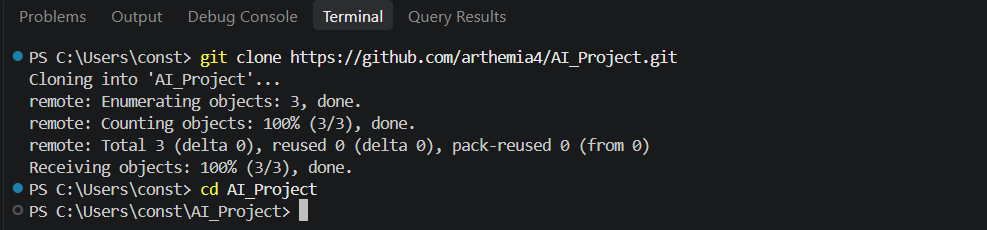
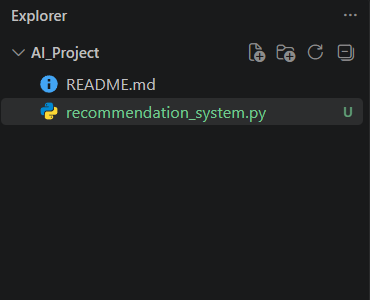
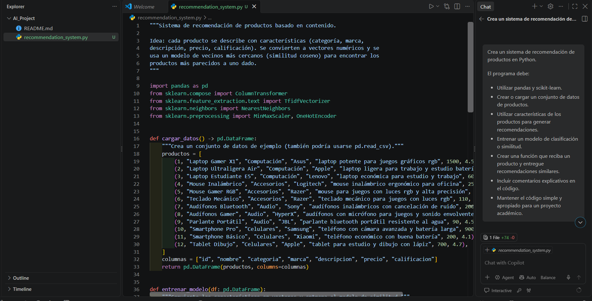
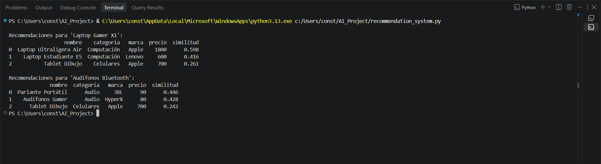
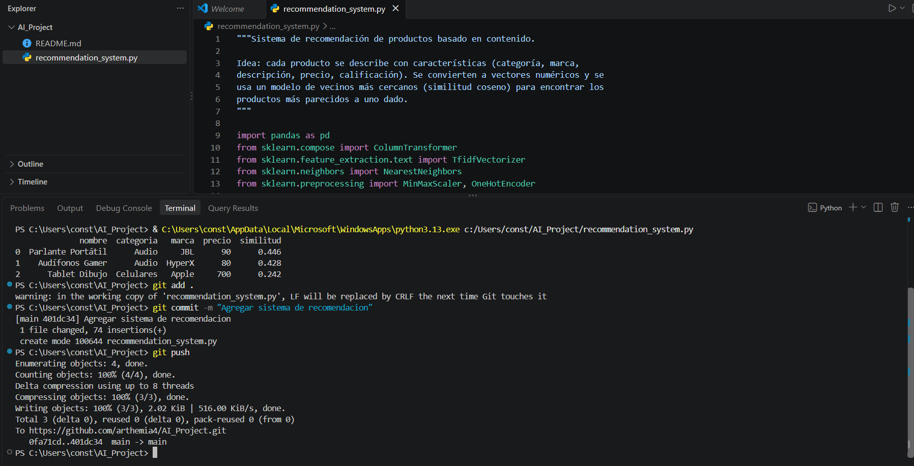

# AI_Project

# AI Project - Sistema de Recomendación

## Descripción

Este proyecto corresponde a una actividad práctica de exploración
de tendencias emergentes en inteligencia artificial utilizando
GitHub Copilot.

El objetivo es desarrollar un sistema de recomendación de productos
utilizando Python y herramientas de aprendizaje automático.

## Herramientas utilizadas

- GitHub
- GitHub Copilot
- Visual Studio Code
- Python
- Pandas
- Scikit-learn

## Desarrollo

### 1. Creación del repositorio

Se creó el repositorio AI_Project en GitHub.

### 2. Clonación del repositorio

El repositorio fue clonado localmente mediante Visual Studio Code.

### 3. Creación del sistema

Se creó el archivo recommendation_system.py.

### 4. Uso de GitHub Copilot

Se utilizó GitHub Copilot para generar una propuesta inicial
del código del sistema de recomendación.

Prompt utilizado:

> Crea un sistema de recomendación de productos en Python...

### 5. Ejecución

Se ejecutó el programa para comprobar su funcionamiento.

### 6. Publicación

Finalmente, los cambios fueron enviados al repositorio remoto
de GitHub.

## Conclusión

La actividad permitió explorar el uso de GitHub Copilot como
herramienta de apoyo para el desarrollo de software y conocer
cómo puede utilizarse la inteligencia artificial para generar
una propuesta inicial de código.